# 31 · A viewer for the document files

**Question.** Every document now has a JATS file (the article) and an ALTO file (every word with its box,
confidence and trust mark). How do you *look* at them — the owner, who checks words against the ink, and a
library or publisher who wants to see what they are getting?

**Answer: `inkscript view`.** The scan with every ALTO word on it, the JATS as a right-to-left article, the
two linked by a click, and both XML files as written.

```
inkscript view experiments/28_scale/out/set              # open http://127.0.0.1:8765/
inkscript view OUT --doc 0392-000-003-002 --open        # one document, straight away
inkscript view OUT --static DIR --doc ID                # a folder that opens from disk, no server
inkscript view OUT --host 0.0.0.0                       # read it on a phone on the same network
```

## What others do (research, 2026-10-07)

- **Libraries, ALTO**: the page image with the OCR laid over it as transparent, selectable text, scaled to
  the image — the IIIF viewers [Mirador](https://projectmirador.org/) with the
  [mirador-textoverlay](https://npmjs.org/package/mirador-textoverlay) plugin
  ([demo](https://mirador-textoverlay.netlify.app)) and the Universal Viewer; newspaper libraries (Library of
  Congress's Chronicling America, Europeana Newspapers) light the boxes of search hits on the page; Transkribus
  shows image and transcription side by side, the line under the cursor lit in both. All need an image
  server, a IIIF manifest per document and a JavaScript build (Mirador's plugin "can only be used if you build
  your own Mirador bundle").
- **Publishers, JATS**: XSLT to HTML ([NCBI's JATS Preview Stylesheets](https://github.com/NCBITools/JATSPreviewStylesheets),
  PMC's [article previewer](https://pmc.ncbi.nlm.nih.gov/tools/article-previewer-intro)), or a reader like
  [eLife Lens](https://github.com/elifesciences/lens): the article in one column, its figures and references in
  the other, a click in one moving the other. JATS4R's recommendations: render `xml:lang` and direction from the
  file, don't guess.
- **What none of them does**: link an article's words to boxes on a scan, or show our trust marks.

Taken: Mirador's word boxes over the image (as SVG, in the image's own pixel frame); Lens's two linked panes;
Transkribus's "light it in both". Built our own small app rather than adopting a stack (D23): Python's
`http.server`, one HTML, one JS and one CSS file (51 KB), no library, nothing fetched from outside.

## What it shows

| | |
|---|---|
| 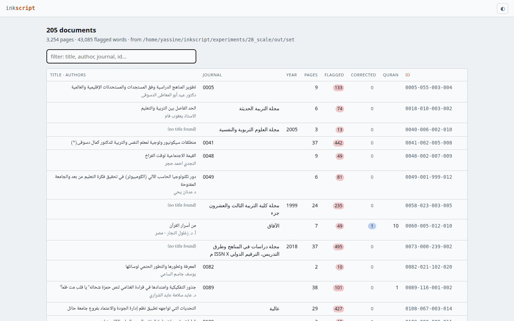 | **The list.** 205 documents of experiment 28: title and authors (from the JATS), journal, year, pages, flagged and corrected words, Quran quotations. Filter, sort by any column. |
| 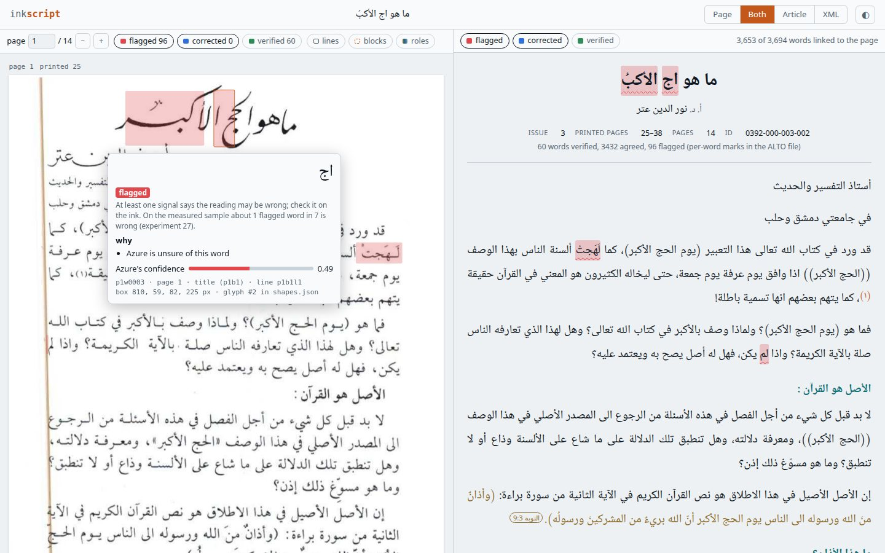 | **Both.** The scan (left) with flagged words tinted red, the article (right). Pointing at a word shows its card: the text, the trust mark and why, Azure's confidence, its ids (word, block, line), its box and its glyph in `shapes.json`. |
| 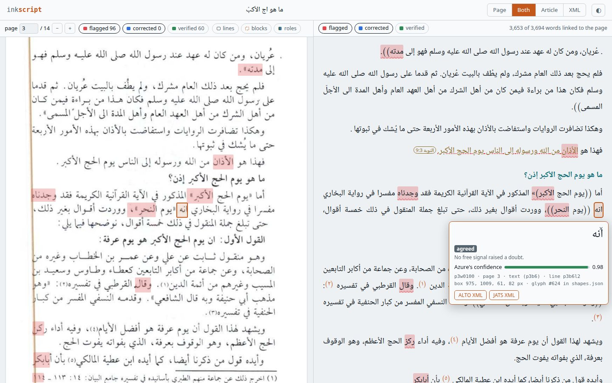 | **Article → page.** A click on a word of the article (`أنه`, p3) puts its box in the middle of the scan and lights it. |
| 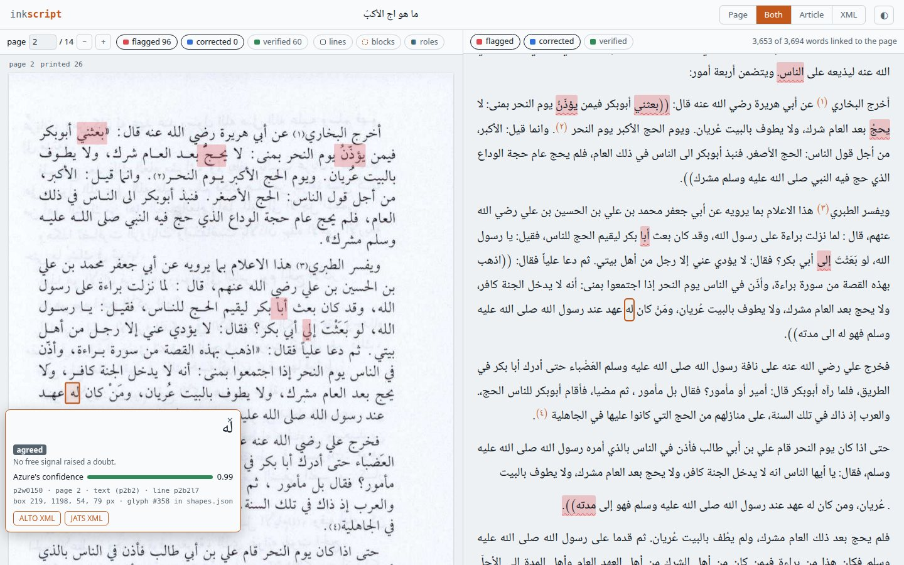 | **Page → article.** A click on a box (`له`, p2) puts that word in the middle of the article. A box of page furniture (a running head, a page number) says it is not in the article. |
| 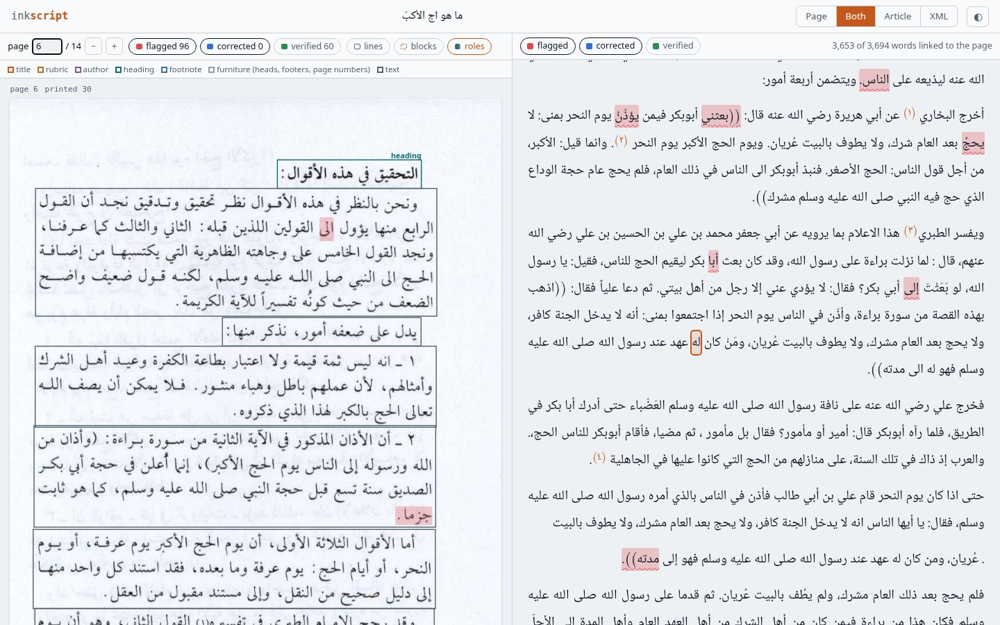 | **Roles.** Each ALTO block outlined in the colour of its role: title, rubric, author, heading, footnote, furniture, text — the structure experiment 26 reads, visible on the page. "lines" and "blocks" draw Azure's lines and the blocks. |
| 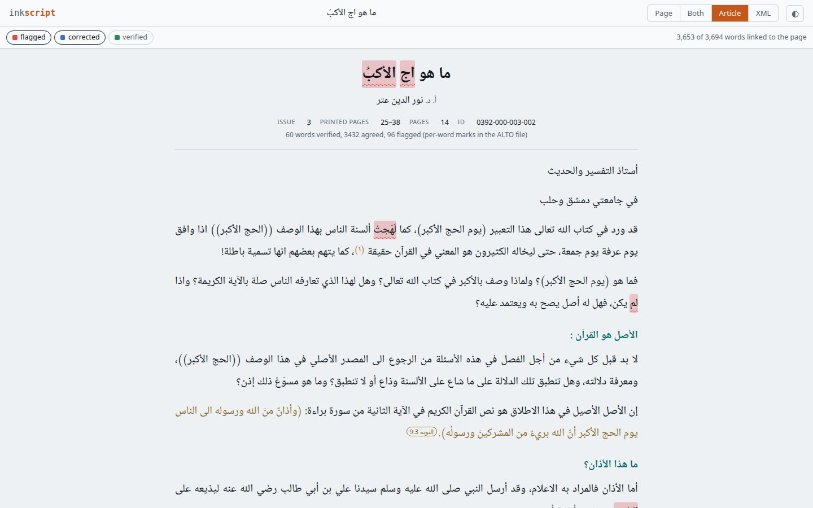 | **Article.** Title, author, the facts (issue, printed pages 25–38), the trust count; headings; quotations in gold with their verse (`التوبة 9:3`, a link to tanzil.net); note markers `(١)` that jump to the note. |
| 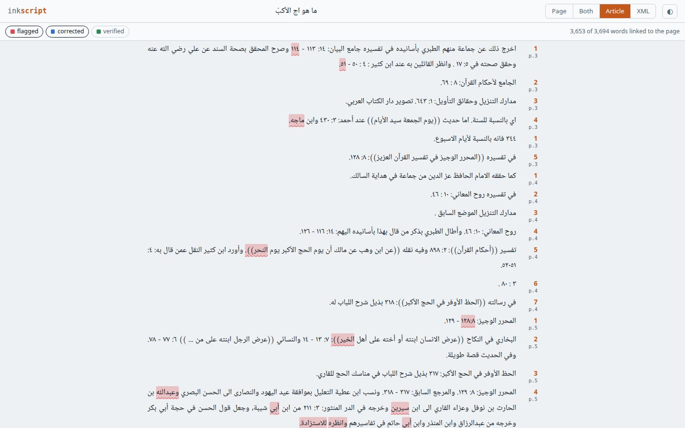 | **Notes.** Each note with its number and its page (many journals number notes per page); the number jumps back to the marker. |
| 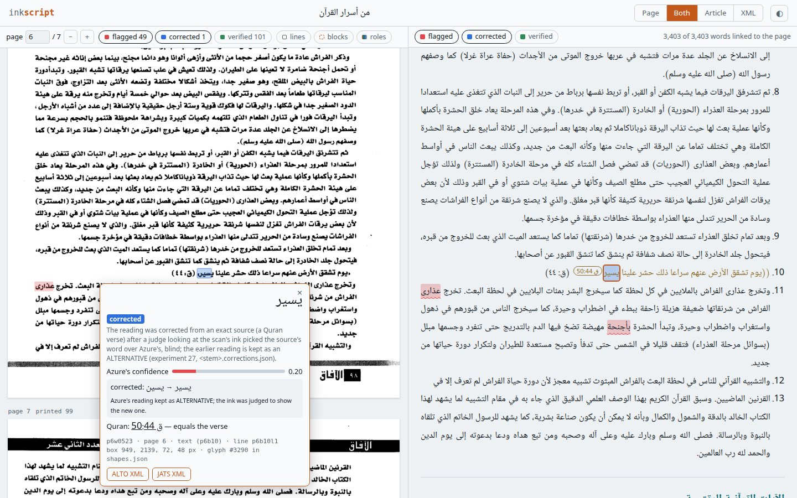 | **A corrected word** (`يسير`, experiment 27): the card shows what Azure read (`يسين`), what the verse and the ink judge chose, and the verse (ق 50:44). Corrected words are tinted blue. |
| 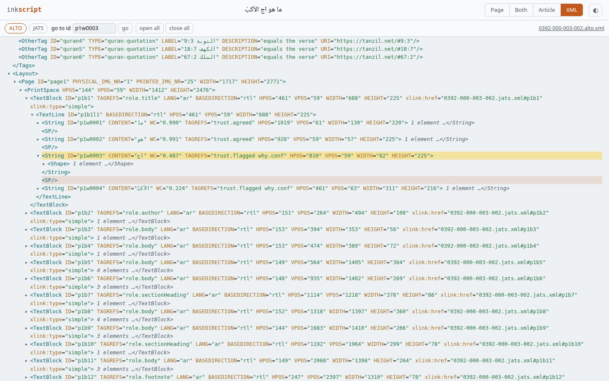 | **XML.** Both files as written, folded; "go to id", or the card's *ALTO XML* / *JATS XML* button, opens the path to the word's `<String>` or its paragraph. |
| 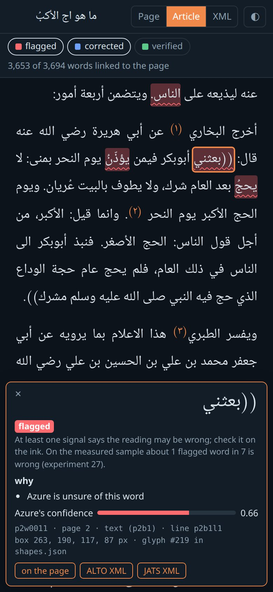 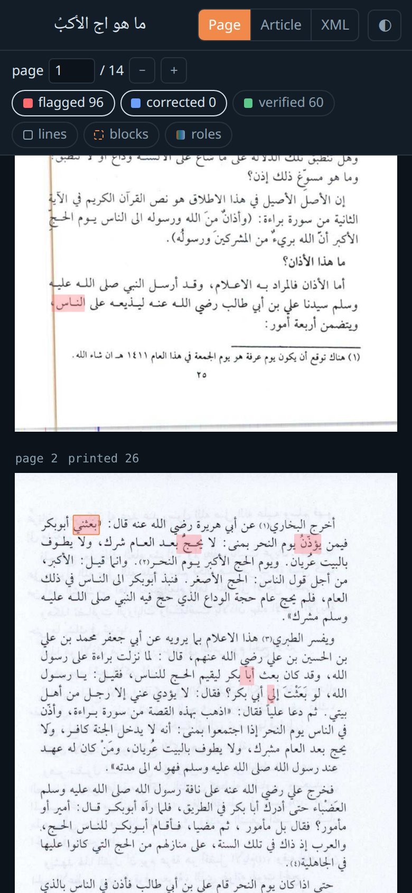 | **Phone, dark.** One pane at a time; a tap pins the card as a sheet at the bottom, lifting the word above it; *on the page* goes to its box. |

## How the two files are linked

The block ids are shared (D20): each ALTO `TextBlock` (`p<page>b<n>`) has the id of the JATS element holding
its words, or points to it (`xlink:href`) when a paragraph runs on to the next page. JATS has no word ids, so
the viewer renders each JATS element's words as spans and matches them, in reading order, to that block's
ALTO words (`viewer/outputs.py`, `_align`): a piece equal to a word (vowel marks, punctuation, alef forms
ignored) takes it; a piece inside a word (`عاصم` before its note link in `عاصم(٢).`) takes it and lets the
rest share it; elements that split a block (`p6b8` a note, `p6b8-2` the text before it) take its words in
turn, whichever order they come in.

Measured on experiment 28's 205 documents (3,254 pages; `measure.py`, `out/measure.json`):

| | |
|---|---|
| article words linked to their box on the scan | **99.85%** (900,130 / 901,457) |
| non-furniture blocks with a place in the article | 46,525 / 46,525 |
| longest document (100 pages): read the ALTO / render the article | 0.55 s / 0.12 s (1 MB of HTML) |
| 48 pages in Chromium: first page and article shown / jump to page 40 / article word on p45 → its box | 0.9 s / 0.2 s / 0.1 s |

Two fixes came from the measurement: matching a split block's parts in turn (1036-000-158-009: 7,538 → 7,746 of 7,753
linked; English notes after Arabic text) and letting a part that comes first in the file but last in the block
(a note written before its paragraph) start from the block's beginning (0392-000-003-002: 3,610 at first, 3,529 after the first fix alone, 3,653 with both). What
is left unlinked is mostly a Gemini title whose words differ from the ink (its block still links) and stray
punctuation.

Fast on long documents: the page list is laid out from the page sizes alone; a page's image and words are
fetched only when it has stayed near the view for 150 ms, so a jump across 40 pages loads 2 pages, not 40.
Page images are rendered once from `<stem>.pdf` (the faithful PDF's background is the scan) at 150 dpi, as
grey PNG when the scan is grey, and cached in `~/.cache/inkscript/view`.

## Files

- `src/inkscript/viewer/outputs.py` — reads a build's files: documents under OUT (any depth), ALTO pages and
  words, the JATS as HTML with word links, page images.
- `src/inkscript/viewer/serve.py` — the local server and `--static`; one URL scheme for both
  (`data/<id>/page-<n>.json` …; a static bundle carries the data as small `.js` files because Chrome does not
  let a page opened from disk `fetch()` its neighbours).
- `src/inkscript/viewer/app/` — `index.html`, `app.js`, `app.css`.
- `tests/test_viewer.py` — the fixture built with `--xml`, then: a page's words are the ALTO strings (text,
  box, mark, alternatives, role), the article's linked words are their ALTO words in reading order, notes link
  to their markers, the server answers (and refuses paths outside), a static bundle loads.
- `measure.py` — the numbers above. Screenshots: `shots/` (scripted Chromium, playwright in a scratch venv).

## What it changed

The owner can now open any document's XML as a page and an article and check a word against its ink in one
click. D23 records the choice of a small viewer of our own. Open (docs/ideas.md, "A viewer for the document
files"): search that lights the boxes; a "next flagged word" review that writes decisions back for
`inkscript fix`; the letters' boxes inside a word.
